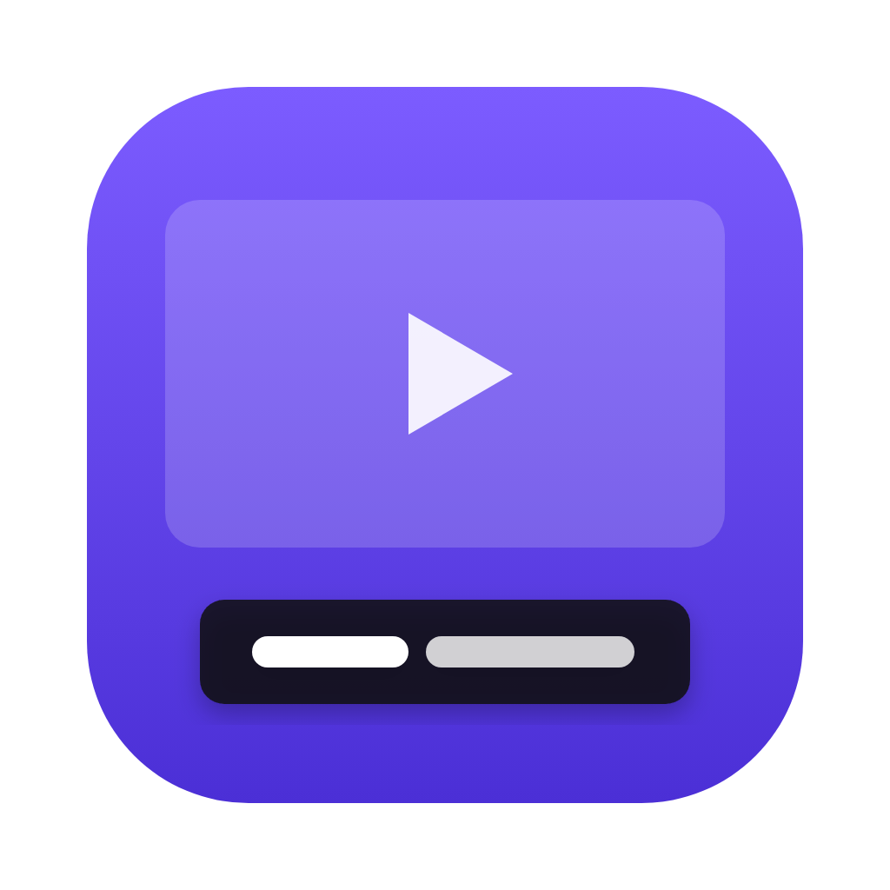
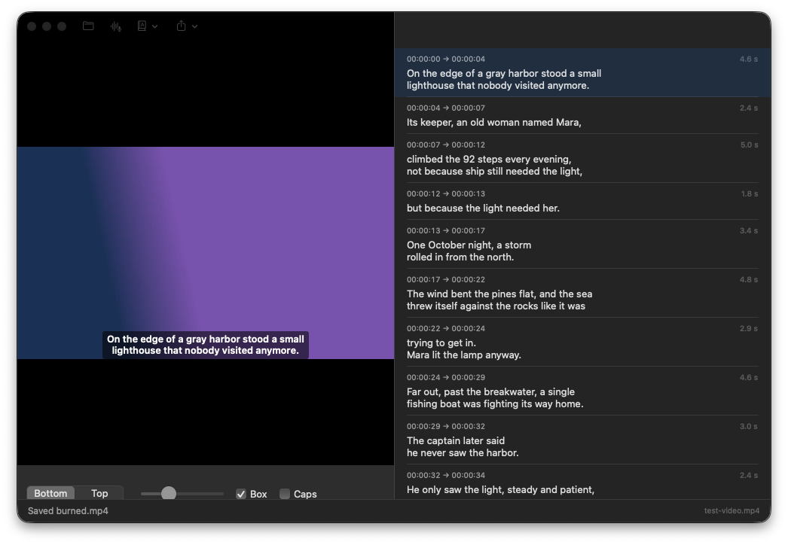

<p align="center">
  
</p>

<h1 align="center">Subtitles</h1>

<p align="center">
  Captions for any video in seconds. Transcribe, fix, translate, burn in. All on your Mac.
</p>

<p align="center">
  <a href="https://github.com/Dunebru/subtitles/releases/latest"></a>
  <a href="https://github.com/Dunebru/subtitles/releases"></a>
  
  
  <a href="LICENSE"></a>
</p>

<p align="center">
  <a href="https://github.com/Dunebru/subtitles/releases/latest"></a>
</p>

Subtitles does what Submagic, Descript and Captions charge $20 to $30 a month for. Speech recognition runs on the Neural Engine with NVIDIA's Parakeet model (25 languages), translation uses the on-device Apple Translation framework, and burn-in is rendered by AVFoundation. Nothing is uploaded, there is no account, and it is faster than real time.

<details>
<summary>Table of contents</summary>

- [Features](#features)
- [Install](#install)
- [Usage](#usage)
- [Languages](#languages)
- [FAQ](#faq)
- [Build from source](#build-from-source)
- [License](#license)
- [Acknowledgements](#acknowledgements)

</details>

## Features

- **Transcribe** any video or audio file: MP4, MOV, M4V, MP3, M4A, WAV and more. A one-hour recording takes well under a minute
- **Broadcast-style cues**: two lines, 42 characters, 1 to 6 seconds, breaks at sentences and pauses. Edit any cue inline
- **Translate** captions to 20 languages on device with Apple's Translation framework (macOS 15+). Show original, translation, or both
- **Live preview** on the video with the exact style that will be burned in
- **Export** SRT, WebVTT, plain transcript, or an MP4 with the captions rendered into the picture
- **Style**: position, size, box or outline, caps
- **Private**: models download once (about 600 MB), then everything runs offline

## Install

Signed with a Developer ID and notarized by Apple, so it opens like any other Mac app.

Download **Subtitles.zip** from the [latest release](https://github.com/Dunebru/subtitles/releases/latest), unzip, move **Subtitles.app** to Applications.

Requires macOS 14 Sonoma or newer on Apple silicon. Translation needs macOS 15.

## Usage

1. Drop a video or audio file on the window.
2. Press **Transcribe**. The first run downloads the speech model.
3. Fix any words in the list on the right. Double-click a cue to jump the video there.
4. Optional: **Translate** to another language. Choose Original, Translation, or Both under the video.
5. **Export** an SRT or VTT file for YouTube, Final Cut, Premiere, or **Burn Into Video** for social media.

## Languages

Transcription: Bulgarian, Croatian, Czech, Danish, Dutch, English, Estonian, Finnish, French, German, Greek, Hungarian, Italian, Latvian, Lithuanian, Maltese, Polish, Portuguese, Romanian, Russian, Slovak, Slovenian, Spanish, Swedish, Ukrainian. The language is detected automatically.

Translation: whatever Apple's Translate app supports on your Mac, including English, Spanish, French, German, Italian, Portuguese, Dutch, Polish, Russian, Ukrainian, Turkish, Arabic, Hindi, Japanese, Korean, Chinese, Indonesian, Vietnamese, Thai. Language packs download the first time you use them.

## FAQ

**How accurate is it?**
Parakeet TDT v3 scores a 5.6% word error rate on English benchmarks, on par with Whisper large and about 20x faster. Names and jargon still need a glance.

**Can I change fonts?**
Not yet. Size, position, box and caps are adjustable. Font choice is on the list.

**Does burn-in re-encode the video?**
Yes, at the highest quality preset. Audio is copied unchanged.

**Why not Whisper?**
Parakeet gives word timings natively and runs on the Neural Engine through CoreML, so it is faster and uses less power.

## Build from source

```bash
git clone https://github.com/Dunebru/subtitles.git && cd subtitles
swift test
scripts/build-app.sh      # dist/Subtitles.app and dist/Subtitles.zip
```

Subtitles is a Swift package with one dependency, [FluidAudio](https://github.com/FluidInference/FluidAudio) (Apache 2.0), vendored under `Vendor/`. The build script fetches the 50 MB text-normalization framework it links against.

## License

[MIT](LICENSE) © dunebru

## Acknowledgements

- [Parakeet TDT 0.6B v3](https://huggingface.co/nvidia/parakeet-tdt-0.6b-v3) by NVIDIA, CC BY 4.0
- [FluidAudio](https://github.com/FluidInference/FluidAudio) for the CoreML port
